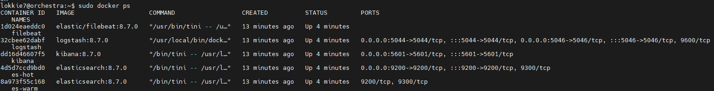
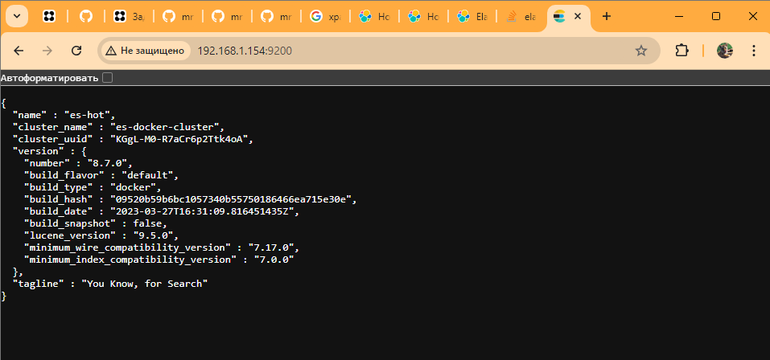
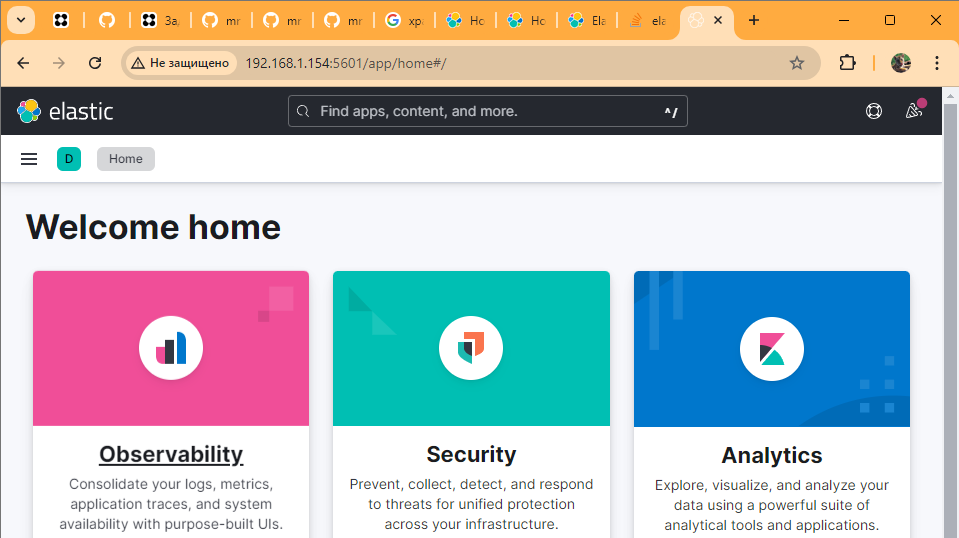
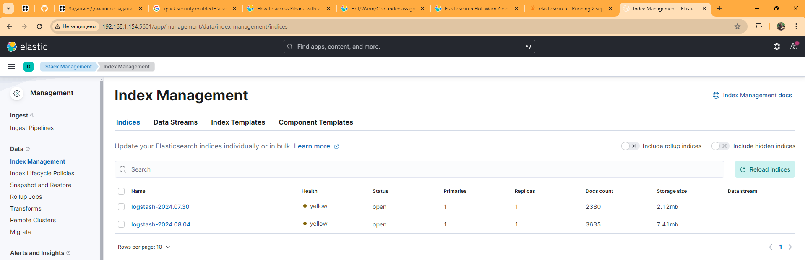
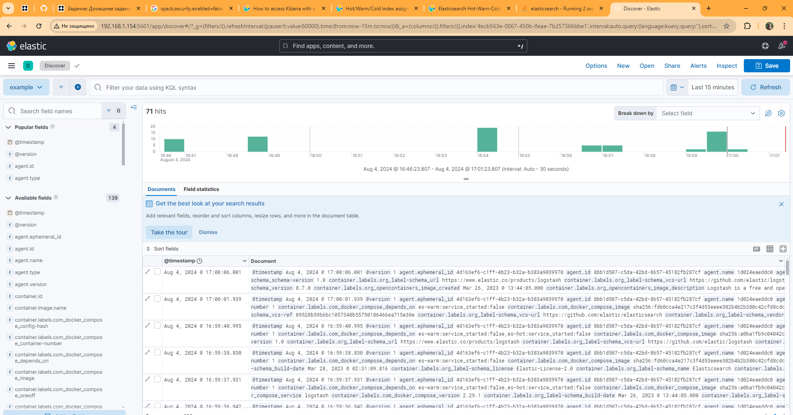

Задание 1 

У меня почти получилось выполнить это задание самостоятельно но я не поняла как сделать hot и warm ноды поэтому в конце использовала предоставленную в директории help. То что в итоге получилось у меня тоже прилагаю.

Запущенные контейнеры docker

Работа ELK

Работа Kibana

Задание 2

Индексы

Просмотр логов

